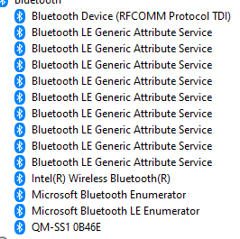

Bring your Mocopi trackers into SteamVR!

Built on the battle-tested algorithms and runtime of SlimeVR, this project aims to improve and extend the Mocopi on PC experience. No first-party app required.

Official Support Discord - https://discord.gg/vCQ2xP8KZb

## Disclaimers
This third-party software is deemed alpha quality, provided as is, and without warranty.
Mocopi is a trademark owned by the Sony Corporation. MoSlime is not endorsed by the Sony Corporation nor SlimeVR, nor are they affiliated with the MoSlime developers.
This software does not modify the firmware of your Mocopi trackers and should not break them. However, only use this software if you agree to assume the risks therein.

## Note about Windows support
Windows 10 and 11 have a feature where Bluetooth LE services are added as individual devices in Device Manager. The problem here is that these service devices aren't unique to every Mocopi and therefore trying to pair / connect more than Mocopi at once will fail. This limits MoSlime to just one tracker on Windows unless a workaround can be found. Until then, we are only officially supporting Linux, more specifically the Raspberry Pi.

## Current and Planned Features
- [x] Auto-connect to trackers (manual pairing still needed) 
- [x] Send IMU rotation data to SlimeVR
- [ ] Prebuilt Raspberry Pi image for easier use
- [ ] Send IMU acceleration data to SlimeVR
- [ ] UI of some sort to allow easy configuration
- [ ] Auto discovery and paring of trackers
- [ ] SlimeVR Server auto discovery

## Requirements
 - Any VM or bare-metal Linux system with Bluetooth and BlueZ as the Bluetooth stack. This system can be seperate from the system that is running SlimeVR.
 - Python 3 with bluepy and scipy installed `pip3 install bluepy scipy`

## Tracker Mounting
With MoSlime, the trackers can be placed and assigned to any body part you want. Assuming you're using moslime alongside a VR headset, here are the recommended tracker positions:
 - Head   - Place on your chest. For most people, the head strap should be big enough to strech over your chest.
 - Hip    - Should still be used for hip
 - Wrists - Use these for your upper legs/knees. You may need to make some custom straps for these (you can use the original mount, just take the 2 screws off the back)
 - Ankles - Should still be used for ankles

## First Time Setup
1. Turn on all of the trackers and pair them to your computer. You can either do this by using your distros Bluetooth manager or via `bluetoothctl`.
2. Take note of the MAC addresses for all of your trackers. They should start with `3C:38:F4`. If you have a tracker that starts with something different, please let us know!
3. Turn off all of the trackers, then disable and re-enable Bluetooth.
4. Download `moslime.py` and `moslime.json` then open `moslime.json` in your favorite text editor. In this file, put the MAC addresses of your trackers in `addresses` and change `slime_ip` to the IP address of the computer you're running SlimeVR on.

## Usage - Please read the steps in their entirety as the process is currently time sensitive!
1. Start the SlimeVR server and wait a few seconds for it to fully load. If you want to use other trackers with SlimeVR, don't turn them on until after you have MoSlime connected. Note: Any Mocopi tracker can be used on any body part. The plastic cover is purely cosmetic!
2. Run `python3 moslime.py`, then immediately turn all the trackers back on. You can either do this manually or by plugging in the case, waiting for the trackers to light up then quickly unplugging it.
3. You should see the lights on the trackers illuminate green one by one as they connect in the terminal. While they are connecting, leave the trackers in the case on a flat and stable surface. DO NOT touch them!
4. Once you see `Safe to start tracking` in the terminal, make sure all trackers appear in SlimeVR. They should show up as IMU Tracker 1, IMU Tracker 2, etc.\
 4a. [Optional]: At this point you can also turn on any additional SlimeVR trackers and use them alongside the Mocopis. Make sure you always start MoSlime first. This issue will be fixed in the future.
5. You can now put on your trackers. If you've never used SlimeVR before, just click on Setup Wizard on the lefthand side and follow the instructions. You can skip the Wi-Fi Settings step.

## Note
If you somehow accidentally close SlimeVR, you'll need to close MoSlime and follow the Usage section again.(make sure you turn the trackers off and restart bluetooth)

## Troubleshooting
 - If trackers are refusing to connect, try stopping the script (mash Ctrl+C till it stops), turn off all the trackers, restart Bluetooth and follow the Usage section again.
 - If your trackers are still refusing to connect, try unparing them, press the button on each tracker 10-15 times to factory reset them (they'll blink red and blue), then pair them again.
 - If you see `Safe to start tracking` but no trackers in SlimeVR, make sure you have the correct IP address and that both computers are on the same network.
 - If your Linux PC is a desktop and range/performance seems really bad, make sure you have your WiFi/BT antenna connected. Alternatively, you can also use an external Bluetooth dongle but your mileage may vary. 

## Tested Bluetooth adapters
 - [SENA UD100](http://www.senanetworks.com/ud100-g03.hl)
 - [Intel 8265NGW - Combo WiFi/BT card](https://www.intel.com/content/www/us/en/products/sku/94150/intel-dual-band-wirelessac-8265/specifications.hl)
 - Raspberry Pi 3B/3B+/4B (3B and 3B+ struggle a bit, it may be a good idea to lower the TPS in moslime.json)

## Contributors
 - [@lmore377](https://github.com/lmore377) - Original Bluetooth reverse-engineering work, Python code, quaternion correction math
 - [@PlatinumVsReality](https://github.com/PlatinumVsReality) - Slime packet generation code, Rust code, wip web interface, graphics, moral support
 - [@itstait](https://github.com/itstait) - Helped optimize multithreading (trust me it used to be much worse)

## Resources
 - https://github.com/lmore377/mocopi-reverse-engineering - Initial reverse engineering work
 - https://github.com/SlimeVR/SlimeVR-Tracker-ESP - Used to figure out networking / packet structure
 - https://github.com/carl-anders/slimevr-wrangler - Used to figure out networking / packet structure
 - https://www.creativefabrica.com/product/coffeecake/ - Font used for the logo. Special thanks to Khurasan!
 - https://www.dafont.com/dripping.font - Additional font used, Dripping by Woodcutter
